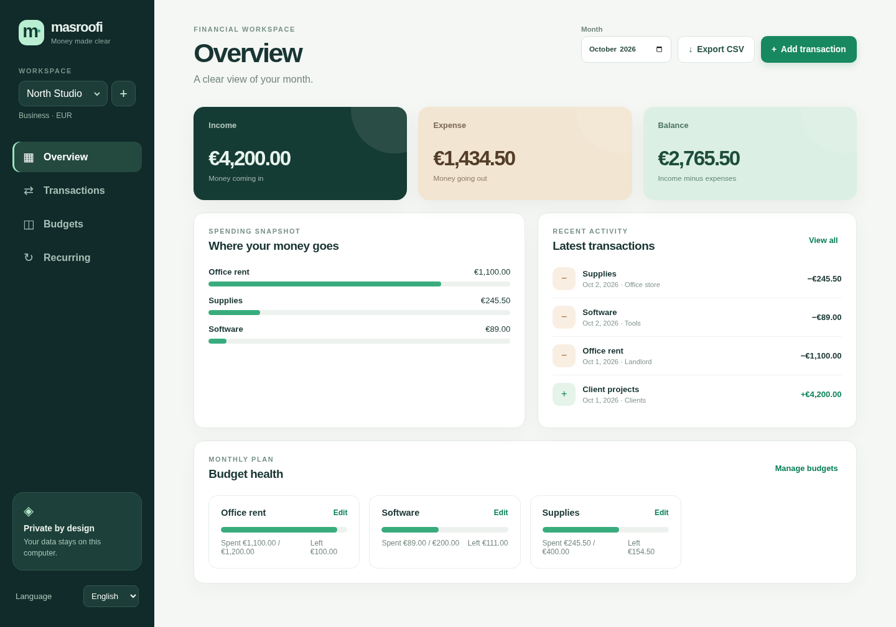

# Masroofi

**A private, local-first money dashboard for families and small businesses.** Track income and expenses, set category budgets, schedule monthly items, and export a month to CSV. The interface is available in **English, French, and Spanish**. It runs with Python's standard library—no subscription, account, or package installation.

**بالعربية:** هذا إصدار ويب أقوى من دفتر المصاريف الأول. يدعم مساحات مستقلة للعائلة والشركة، ميزانيات شهرية، مصاريف ودخل متكرر، وتصدير CSV. الواجهة بالإنجليزية والفرنسية والإسبانية؛ بياناتك تبقى على جهازك.



## Start / Démarrer / Iniciar

Python 3.9+ is required. In the repository folder:

```bash
python3 app.py
```

Open `http://127.0.0.1:8765` in your browser. Create a **Family / Famille / Familia** or **Business / Entreprise / Negocio** workspace, choose its currency, and add your first transaction. Use the language selector at the bottom of the sidebar.

```bash
python3 app.py --port 9000                         # another local port
python3 app.py --db /path/to/my-finances.sqlite3   # another database file
python3 -m unittest discover -s tests -v           # run the tests
```

In the Codex cloud workspace, use a writable database path:

```bash
cd /workspace/Morningstar
python3 app.py --db /workspace/scratch/masroofi.sqlite3
```

The app listens only on `127.0.0.1`. It has no login or team synchronization, so it is intended for one computer, not for direct exposure on a public network.

## What you can do

| English | Français | Español |
| --- | --- | --- |
| Separate family and business workspaces | Espaces famille et entreprise séparés | Espacios separados para familia y negocio |
| Income and expenses by month and category | Revenus et dépenses par mois et catégorie | Ingresos y gastos por mes y categoría |
| Category budgets with overspending alerts | Budgets par catégorie et dépassements | Presupuestos por categoría y excesos |
| Monthly recurring entries | Opérations mensuelles récurrentes | Movimientos mensuales recurrentes |
| Search and filter transactions | Recherche et filtres des opérations | Búsqueda y filtros de movimientos |
| CSV export for the selected month | Export CSV du mois choisi | Exportación CSV del mes seleccionado |

Recurring entries are created when you open a due month after its scheduled day. Days 29–31 fall on the last day of shorter months. Removing a rule keeps already recorded transactions. Budgets apply only to the month selected; they do not automatically carry forward. Amounts within a workspace use one currency, with no currency conversion.

## Data and backups

The web app stores its database in `~/.morningstar/masroofi.sqlite3` by default. Stop the app and copy that file to make a full backup. The CSV button exports only the selected month and workspace.

The original Arabic command-line tool remains available as `expenses.py` and continues to use `~/.morningstar/expenses.json`. Its data is separate from the web app database; keep that JSON file if you used the older version.

This is an expense organizer, not a tax, payroll, invoicing, or banking integration service.
